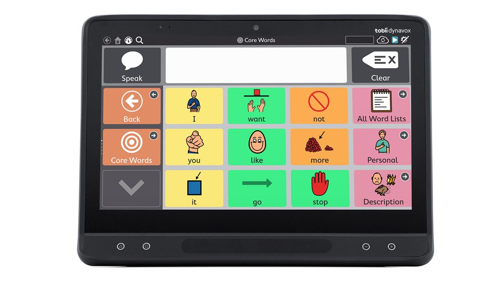

# Techlauncher Eye-Gaze-Technology
<h2><a name = "content"> Table of Contents </a></h2>

<a href = "#Title1"><b> 1. Project Description </b></a> 
<a href = "#Title2"><b> 2. Project Administration </b></a> 
<a href = "#Title3"><b> 3. Traceability of Progress </b></a>  
<a href = "#Title4"><b> 4. Technical Tools and Constraints </b></a> 

 

<h2><a name = "Title1"> 1. Project Overview </a></h2>

According to the World Health Organization, roughly 15% of the world's population live with some form of disability. There is a technology that helps people with disabilities to communicate better in lives. The major barrier however in accessing this technology is it's high cost that most people cannot afford. To promote the inclusivity of this technology, we are seeking to recreate this technology to leverage the smart phone platform.

The Eye Gaze technology has been widely used to capture eye movement and focus through infrared cameras and in turn control the screen display without physical interaction. Infrared cameras, developed at the quality required for eye tracking, are expensive. This makes the final product of eye gaze technology no longer affordable to the general populace. This project seeks for solutions to replace infrared cameras with smart phone cameras which are much more affordable and accessible. Our project proposes a communication assistance application via face and eye tracking to enable them to select words and compose sentences for disabled people. We seek to improve their ability to communicate their feelings and thoughts more effectively through our designed user interface.

<h3> Stakeholders </h3>

#### End-users:
Our project serves children with neural diseases that affects their body coordination, which means they cannot control their hands to click on mobile phones. Besides, our end-users may not have verbal capacity to sound their voices and needs. They may have:-
                <ul>
                <li>Amyotrophic lateral sclerosis(ALS)</li>
                <li>Parkinson's Disease</li>
                <li>Brain injury</li>
                <li>Cerebral Pulsy</li>
                <li>Autism</li>
                </ul>
                
#### Clients:
Our clients raise great expectations to minimize the expenses on the hardware used in the eye gaze technology which merely seek solutions to replace infrared cameras. Both eye gaze technology and face tracking are permitted that no involvement of hand or verbal inputs.Our Clients are:-
* Alex Mironox (Primary)
* Ted Pettigrove 
* Kate Needham
* Ryan Whitmore 
* Shannon Glover

<h2><a name = "Title2"> 2. Project Administration </a></h2>

<h3> 2.1 Schedule</h3>

#### Deliverable 1: Research Analysis (Semester 1:Before Week 8 ~26/04)

* User research: 
To collect data about the end users & to analyse their common characteristics & difficulties;to ideate possible solutions to make their communication better.
* Technology analysis:
Research about the feasibility of implementing those possible solutions.
Analysis include research on mobile device libraries + peripherals (to replace IR camera)

* Research on:
  >Face Tracking: It will be able to track facial inputs whether the eye is open or not & the angle of the head such that it can be used to select & operate the Application UI.

  >Eye Gaze: It will be able to track the eye gaze on the screen and concentrate the attention into a spot which will change smoothly as eye gaze shifts.
  

    
#### Deliverable 2: Two exploratory tools (Before Week 10 ~10/05 )
* The exploratory tools consist of core function that we expect to use in the second semester.
Creating sample content without interactions with cursors
Enable eye gaze tracking & facial tracking to imitate cursor movement & click events.

Further Deliverables will be discovered in next Semester.

   

<h3> 2.2 Team Roles </h3>

#### Project Manager (Minju)
 - Responsible to ensure that software development is suitably goverened and reported on
 - Primary client liason
 - Responsible for Project Management Platforms (Jira & Confluence)
 
#### Technical Lead (Maojun)
 - Works with the developers to articulate technical goals
 - Works with the Project Manager to prioritise technical goals into an agreed plan that ensures quality and a timely delivery 

#### Developers (Kalai & Soobin)
 - Responsible for scoping cost, effort and timelines to deliver the technical solutions 
 - Builds the deliverables and communicates the status of the software components to the Technical Lead and Project Manager

<h2><a name = "Title3"> 3. Traceability of Progress</a></h2>

#### Communication:
[Slack](https://app.slack.com/client/TUX4W2LDP/CV9DJ2ZQW)
#### Documentation:
[All](https://drive.google.com/drive/folders/1NlzcfOPzjzUGLZtv5XBwhFZTKDHvKzTZ)

  * [Decision Making](https://drive.google.com/open?id=1saNyL4HzxOY_hxSUxgXdmyMEt44hYi6K)

  * [Feedback & Reflection](https://drive.google.com/open?id=1Ez3zpXuvb3K82JIZOckS8c_vj4hy5sOG)

  * [Meeting Minutes](https://drive.google.com/open?id=1XRX-F2_kUdTftGIQKBF57nrPVdt4L3jy)

  * [Risk Analysis](https://drive.google.com/open?id=1Uw5uD4dYpGCd37f2pzDuS4Xqts_sX_hmQ5OORyHsGHU)

#### Teamwork:
<a href = "https://comp3500.atlassian.net/jira/software/projects/MEGT/boards/1/roadmap"><b> Jira Project Management Platform </b></a>

[GuestAccount](https://id.atlassian.com/login?application=jira&continue=https%3A%2F%2Fcomp3500.atlassian.net%2Flogin%3FredirectCount%3D1%26dest-url%3D%252Fjira%252Fsoftware%252Fprojects%252FMEGT%252Fboards%252F1%252Froadmap%26application%3Djira&email=audit.techlauncher%40outlook.com) (Note: Copy _PW_ before clicking GuestAccount)
 - _ID_: audit.techlauncher@outlook.com
 - _PW_: 2020techlauncher

<h2><a name = "Title4"> 4. Technical Tools and Constraints</a></h2>

**Technical Tools:**
 - Development platform: Android Studio
 - Face & eye tracking library: Google Mobile Vision API
 - Eye gaze technology library: OpenCV
 

**Project Constraints:**
- Affordability of the technology to ensure the cost on software and hardware are low.
 - No hand motions.
 - No verbal inputs.
 - Assume that the end-users may have the capacity to focus their eye gaze and control head motions.
 

