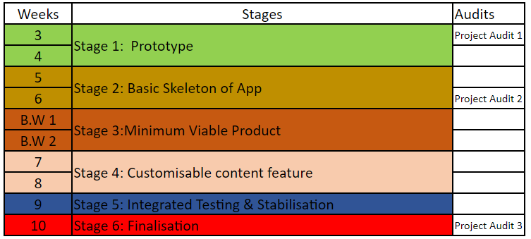

# Techlauncher Eye-Gaze-Technology
<h2><a name = "content"> Table of Contents </a></h2>

<a href = "#Title1"><b> 1. Project Description </b></a> 
<a href = "#Title2"><b> 2. Project Administration </b></a> 
<a href = "#Title3"><b> 3. Traceability of Progress </b></a>  
<a href = "#Title5"><b> 4. Technical Tools and Constraints </b></a> 

 

<h2><a name = "Title1"> 1. Project Overview </a></h2>

Eye gaze technology has been widely used to capture eye sights through infrared cameras to control panels without hand click events. While there are critical expenses on infrared cameras which make the eye gaze technology no longer affordable to the general families. This project is proposed to seek for solutions to replace infrared cameras with mobile cameras which would be much more affordable and accessible. Considering that our end-users may have neural inabilities that they may have great difficulties to manage their body coordination and sound their voices. Our project proposes a communication assistance application via face tracking technology and eye gaze tracking technology to enhance them to select words and draft sentences. Hopefully, their feelings and thoughts could be expressed through our designed user interface.

<h3> 2.4 Stakeholders </h3>

#### End-users:
Our project serves children with neural diseases that affects their body coordination, which means they cannot control their hands to click on mobile phones. Besides, our end-users may not have verbal capacity to sound their voices and needs. They may struggle with
                <ul>
                <li>Amyotrophic lateral sclerosis(ALS)</li>
                <li>Parkinson's Disease</li>
                <li>Brain injury</li>
                <li>Cerebral Pulsy</li>
                <li>Autism</li>
                </ul>
                
#### Client:
Our client raises great expectations to minimize the expenses on the hardware used in the eye gaze technology which merely seek solutions to replace infrared cameras. Both eye gaze technology and face tracking are permitted that no involvement of hand or verbal inputs.
 

<h2><a name = "Title2"> 2. Project Administration </a></h2>

<h3> 2.1 Timeline  & Deliverables</h3>

<h3> 2.3 Team Roles </h3>

#### Project Manager (Minju)
 - Responsible to ensure that software development is suitably goverened and reported on
 - Primary client liason
 - Responsible for Project Management Platforms (Jira & Confluence)
 
#### Technical Lead (Maojun)
 - Works with the developers to articulate technical goals
 - Works with the Project Manager to prioritise technical goals into an agreed plan that ensures quality and a timely delivery 

#### Developers (Kalai & Soobin)
 - Responsible for scoping cost, effort and timelines to deliver the technical solutions 
 - Builds the deliverables and communicates the status of the software components to the Technical Lead and Project Manager

<h2><a name = "Title3"> 3. Traceability of Progress</a></h2>

https://comp3500.atlassian.net/jira/software/projects/MEGT/boards/1

Guest Account:
 - ID: audit.techlauncher
 - PW: 2020techlauncher

<h2><a name = "Title3"> 4. Technical Tools and Constraints</a></h2>

**Technical Tools:**
Android Studio

**Project Constraints:**
 - We expect the users to be able to control their eye and head movement.

