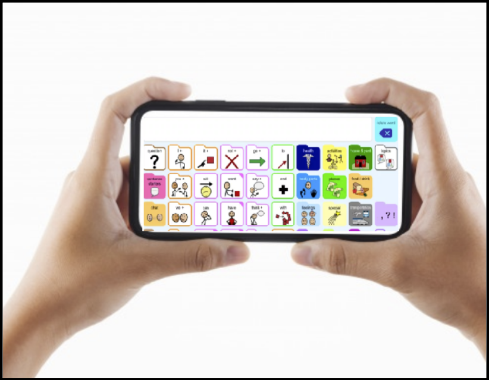

# Track Pupils  
## TechLauncher Project 2020 S2 | 20-S1-2-C Track Pupils

<h2><a name = "content"> Contents </a></h2>

<a href = "#Title1"><b> 1. Project Overview </b></a> 
<a href = "#Title2"><b> 2. Project Administration </b></a> 
<a href = "#Title3"><b> 3. Traceability of Progress & Teamwork </b></a>  
<a href = "#Title4"><b> 4. Documentation </b></a>  
<a href = "#Title5"><b> 5. Technical Tools and Constraints </b></a> 

<h2> Quick Link Dropdown</h2>

- [**All Documentations**](https://drive.google.com/drive/folders/1NlzcfOPzjzUGLZtv5XBwhFZTKDHvKzTZ?usp=sharing)
- [**Decision Log**](https://drive.google.com/drive/folders/18C8N5hQrXN94pWgNyDpYCfhkNWzhSczE)
- [**Feedback & Reflection Log**](https://drive.google.com/drive/folders/1Tty_NjlyNDwHHwNLGD4vDpX-9KjvH998)
- [**Meeting Minutes**](https://drive.google.com/drive/folders/1bz6aJNaLhqgxjfCjiWHxQpbSfh9tgEOj?usp=sharing)
    + [Team Meeting](https://drive.google.com/drive/folders/1HjPLR9FZ_2_iRm91MV_KgGgtAlXXAkB5)
    + [Client Meeting](https://drive.google.com/drive/folders/1JjdIRBprHv1TsyhMA9yGrYzDufUeJb3o)
- [**Trello**](https://trello.com/b/GnYy2QBX/track-pupils)
- [**Weekly Working Hours Log**](https://docs.google.com/spreadsheets/d/1fvAgWoog8Ptu7ehS3y6uI3UGOBSutxZZ_a82oMGfk1E/edit?usp=sharing)
- [**User Story Map**](https://miro.com/app/board/o9J_kodemu8=/)
- [**Risk Register**](https://docs.google.com/document/d/1h8wtWSBGq10KgU5FjX3noPZQz0TSMrlTSjl1m9pVcEc/edit?usp=sharing)
- [**Communication(Slack, Google Hangout,Whatsapp and Zoom)**](https://docs.google.com/document/d/1fOy_x4CNGdVu6nbyG_zbYGBBXU7Pvlio7XnqYfclkDY/edit)
- [**Technical Tools**](https://github.com/Ozedaval/Eye-Gaze-Technology/wiki/Technical-Tools)
- [**Project Constraints**](https://github.com/Ozedaval/Eye-Gaze-Technology/wiki/Project-Constraints)
- [**IP Agreement**](https://drive.google.com/file/d/1D6lRpcF439EluSAafE8FFhUSrTIISbAN/view?usp=sharing)
- [**Acceptance Criteria**](https://docs.google.com/document/d/1NwzMyvCJ_EW52ajgg5v6M_LCen3BKqRJok3HZnjJcT8/edit)
- [**References**](https://github.com/Ozedaval/Eye-Gaze-Technology/wiki/References)
- [**Feedback**](https://drive.google.com/open?id=1j--azvBIf_7xkufhe8fR2g7GvuG47eTfvsKeAyDyk6Y)
- [**Statement of Work**](https://github.com/Ozedaval/Eye-Gaze-Technology/wiki/Deliverables)
- [**Installation Instructions**](https://github.com/Ozedaval/Eye-Gaze-Technology/wiki/Installation-Instructions)
 
 

<a href="https://drive.google.com/file/d/1rmTdVeeDP9rK3k5MDW1rzWMEKGuHVCln/view?usp=sharing">MVP snippet</a> 
 
<a href="https://drive.google.com/file/d/19Z20QgDJi-uiaTi0ZIYdc1OYAtlCUJ0r/view?usp=sharing">Link to full video</a> 

<h2><a name = "Title1"> 1. Project Overview </a></h2>

* Background : According to the World Health Organization, roughly 15% of the world's population live with some form of disability. Technology like Eye Gaze Technology can help disabled people who have neural diseases which prevent them from interacting physically with ease. However, Commercial products which use Eye gaze technology are usually expensive. To promote the inclusivity of this technology, we are seeking to recreate this technology to leverage the smartphone platform and thus making eye gaze technology more affordable.
* Our Project attempts to build an Augmentative and Alternative Communication **(AAC)** tool which can be used with eye gaze as an control.

* **For Who?** : People who have difficulties interacting with mobile devices and communicating using speech with ease. 

* [**Stakeholders of the Project**](https://github.com/Ozedaval/Eye-Gaze-Technology/wiki/Stakeholders)
 

<h2><a name = "Title2"> 2. Project Administration </a></h2>

* [**Team Members & Roles**](https://github.com/Ozedaval/Eye-Gaze-Technology/wiki/Team-Members-&-Roles)
* [**Estimated Schedule**](https://github.com/Ozedaval/Eye-Gaze-Technology/wiki/Estimated-Schedule)
* [**Deliverables**](https://github.com/Ozedaval/Eye-Gaze-Technology/wiki/Deliverables)
* [**Statement of Work**](https://github.com/Ozedaval/Eye-Gaze-Technology/wiki/Deliverables)

<h2><a name = "Title3"> 3. Traceability of Progress & Teamwork</a></h2>

* [**Trello**](https://trello.com/b/GnYy2QBX/track-pupils)
* [**Weekly Working Hours Log**](https://docs.google.com/spreadsheets/d/1fvAgWoog8Ptu7ehS3y6uI3UGOBSutxZZ_a82oMGfk1E/edit?usp=sharing)

    

<h2><a name = "Title4"> 4. Documentation</a></h2>

- [**All**](https://drive.google.com/drive/folders/1NlzcfOPzjzUGLZtv5XBwhFZTKDHvKzTZ?usp=sharing)
- [**App Architecture UML (Brief/Top level)**](https://drive.google.com/file/d/15Xfe_FKf86Dg00DQ7rLXrEMzJ7PCGsy5/view)
- [**Decision Log**](https://drive.google.com/drive/folders/18C8N5hQrXN94pWgNyDpYCfhkNWzhSczE)
- [**Output**](https://drive.google.com/drive/folders/11VEx6xQj-KdvEMwhQfAj3t7v0ngSZa2l)
- [**Feedback & Reflection Log**](https://drive.google.com/drive/folders/1Tty_NjlyNDwHHwNLGD4vDpX-9KjvH998)
- [**Meeting Minutes**](https://drive.google.com/drive/folders/1bz6aJNaLhqgxjfCjiWHxQpbSfh9tgEOj?usp=sharing)
    + [Team Meeting](https://drive.google.com/drive/folders/1HjPLR9FZ_2_iRm91MV_KgGgtAlXXAkB5)
    + [Client Meeting](https://drive.google.com/drive/folders/1JjdIRBprHv1TsyhMA9yGrYzDufUeJb3o)
- [**User Story Map**](https://miro.com/app/board/o9J_kodemu8=/)
- [**Acceptance Criteria**](https://docs.google.com/document/d/1NwzMyvCJ_EW52ajgg5v6M_LCen3BKqRJok3HZnjJcT8/edit)
- [**Risk Register**](https://docs.google.com/document/d/1h8wtWSBGq10KgU5FjX3noPZQz0TSMrlTSjl1m9pVcEc/edit?usp=sharing)
- [**Communication(Slack, Google Hangout,Whatsapp and Zoom)**](https://docs.google.com/document/d/1fOy_x4CNGdVu6nbyG_zbYGBBXU7Pvlio7XnqYfclkDY/edit)

<h2><a name = "Title5"> 5. Technical Tools and Constraints</a></h2>
  
 * [**Technical Tools**](https://github.com/Ozedaval/Eye-Gaze-Technology/wiki/Technical-Tools)

 * [**Project Constraints**](https://github.com/Ozedaval/Eye-Gaze-Technology/wiki/Project-Constraints)
 
 
 <h2><a name = "Miscellaneous">Miscellaneous</a></h2>

 * [**References**](https://github.com/Ozedaval/Eye-Gaze-Technology/wiki/References)

 * [**Feedback**](https://drive.google.com/open?id=1j--azvBIf_7xkufhe8fR2g7GvuG47eTfvsKeAyDyk6Y)

 * [**Installation Instructions**](https://github.com/Ozedaval/Eye-Gaze-Technology/wiki/Installation-Instructions)
 
 
 
